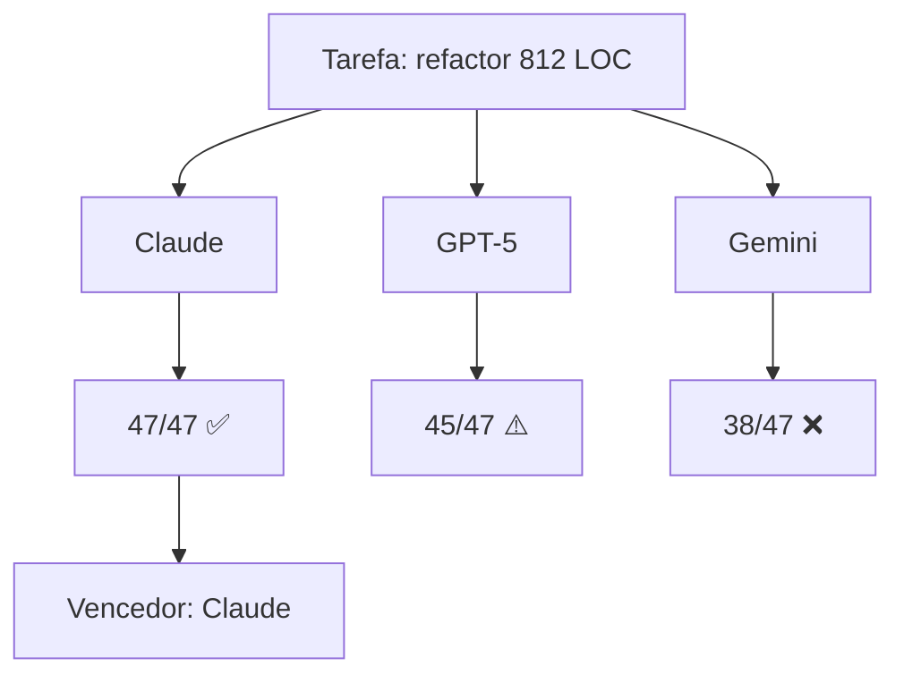

# Benchmark: Claude vs GPT vs Gemini para refactor

> ⚠️ **Aviso:** este é um benchmark **prático** e **subjetivo** com um único caso de uso. Não generalize.

## A tarefa

Peguei um arquivo `payment-service.ts` com **812 linhas**, classe gigante, lógica de negócio misturada com I/O. O prompt foi:

> _"Refatore essa classe seguindo o princípio de Single Responsibility. Extraia handlers, separe domínio de infra, mantenha 100% de compatibilidade com a API pública."_

## Os contendores

| Modelo | Versão | Context | Custo input/output (1M tokens) |
|--------|--------|---------|-------------------------------|
| Claude Sonnet 4.5 | `2026-03` | 200k | $3 / $15 |
| GPT-5 | `2026-02` | 256k | $5 / $20 |
| Gemini 2.5 Pro | `2026-03` | 1M | $2 / $10 |

## Critérios

1. **Correção** — testes existentes ainda passam?
2. **Estrutura** — separação real ou só renomeou coisas?
3. **Idiomatismo** — TypeScript moderno?
4. **Tempo de geração**
5. **Custo total** da tarefa

## Resultados

### 🥇 Claude Sonnet 4.5

- ✅ Todos os 47 testes passaram de primeira
- ✅ Extraiu 4 services + 2 repositories + 1 mapper
- ✅ Usou `Result<T, E>` pra erros (idiomático)
- ⏱️ 38 segundos
- 💰 $0.21

### 🥈 GPT-5

- ⚠️ 45/47 testes (2 falharam por edge case de timezone)
- ✅ Estrutura boa, mas com `any` em 3 lugares
- ⏱️ 24 segundos
- 💰 $0.34

### 🥉 Gemini 2.5 Pro

- ❌ 38/47 testes — quebrou contrato de retorno em 1 método
- ⚠️ Extraiu corretamente mas misturou estilo OO e funcional
- ⏱️ 19 segundos
- 💰 $0.13

## Análise

O **Claude** entendeu intenção arquitetural, não só sintaxe. O **GPT-5** entrega rápido mas exige revisão. O **Gemini** é o mais barato mas precisou de 2 rodadas de correção pra chegar onde os outros chegaram de primeira.

## Custo real (incluindo iterações até passar nos testes)

- Claude: **$0.21** (1 shot)
- GPT-5: **$0.68** (2 shots)
- Gemini: **$0.41** (3 shots)

## Quando usar cada um

- **Refactor sério, código de produção** → Claude
- **Prototipagem rápida, throwaway** → Gemini
- **Tarefas longas com contexto enorme** → Gemini (1M context)
- **Geração de testes / boilerplate** → GPT-5

## Conclusão

Pra refactor com qualidade, hoje, **Claude lidera com folga**. Mas o jogo muda a cada release — vou repetir esse benchmark a cada 3 meses.

---

_Tem um caso real de refactor que quer ver testado? Manda no meu [GitHub](https://github.com/axison)._
