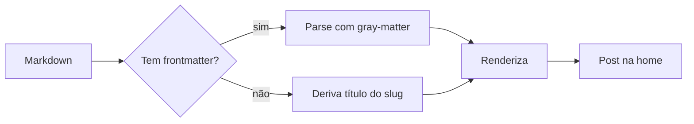
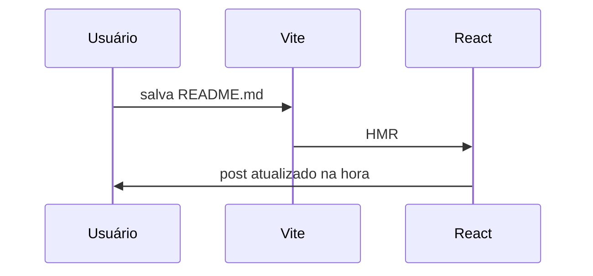
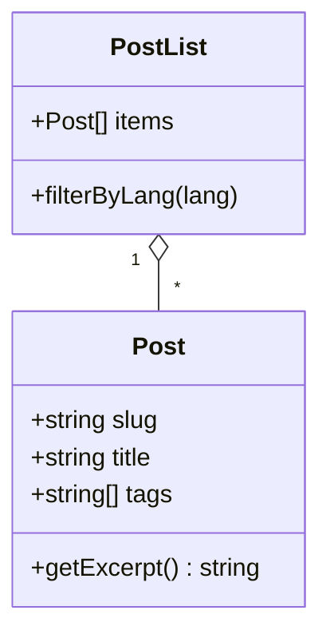

Esse post é uma **referência viva** dos recursos de markdown disponíveis no blog. Use ele como template / cheatsheet quando for escrever algo novo.

## Sumário

- [Texto e formatação](#texto-e-formatação)
- [Listas](#listas)
- [Citações](#citações)
- [Links](#links)
- [Imagens](#imagens)
- [Vídeos](#vídeos)
- [Code blocks](#code-blocks)
- [Mermaid](#mermaid)
- [Tabelas](#tabelas)
- [Outros](#outros)

---

## Texto e formatação

Texto normal, com **negrito**, *itálico*, ***ambos***, ~~riscado~~ e `código inline`.

Você também pode usar <kbd>Ctrl</kbd> + <kbd>K</kbd> para atalhos de teclado (HTML cru funciona porque temos `rehype-raw`).

Quebra de linha simples vira espaço.
Quebra dupla vira parágrafo novo.

---

## Listas

### Não ordenada

- item um
- item dois
  - subitem aninhado
  - outro subitem
    - mais fundo ainda
- item três

### Ordenada

1. primeiro passo
2. segundo passo
3. terceiro passo
   1. sub-passo
   2. sub-passo

### Tarefas (GFM)

- [x] suportar markdown puro
- [x] suportar mermaid
- [ ] adicionar busca
- [ ] adicionar RSS

---

## Citações

> "Simplicidade é a sofisticação suprema."
> — Leonardo da Vinci

Citações também aceitam **formatação interna** e [links](https://axison.dev).

> Bloco com várias linhas
> e até código inline `como esse`
> dentro dele.

---

## Links

### Externos

- [Lovable](https://lovable.dev) — abre em nova aba automaticamente
- [Documentação do React](https://react.dev)

### Internos (outros posts)

- [Bem-vindo ao axison.dev](/posts/2026-04-22_bem-vindo-ao-axison-dev)
- [Setup Neovim para Dev IA](/posts/2026-04-18_setup-neovim-dev-ia)
- [Benchmark Claude vs GPT vs Gemini](/posts/2026-04-10_benchmark-claude-gpt-gemini-refactor)

### Âncoras (dentro do post)

- [Voltar para o sumário](#sumário)
- [Pular para code blocks](#code-blocks)
- [Pular para mermaid](#mermaid)

> Cabeçalhos viram âncoras automaticamente via `rehype-slug`. Passe o mouse num título e clique no `#` que aparece pra copiar o link direto.

---

## Imagens

### Imagem externa


### Imagem local (pasta `assets/`)

Quando você adicionar uma imagem na pasta `assets/` do post, referencie assim:

```markdown

```

O Vite resolve o caminho e gera a URL com hash automaticamente.

### Com legenda (HTML)

<figure>
  
  <figcaption style="text-align:center;font-size:0.85em;color:hsl(var(--muted-foreground));margin-top:0.5em;">
    Legenda opcional usando &lt;figure&gt; e &lt;figcaption&gt;.
  </figcaption>
</figure>

---

## Vídeos

### Vídeo HTML5 (MP4 local ou remoto)

<video controls width="100%" style="border-radius:var(--radius);border:1px solid hsl(var(--border));">
  <source src="https://download.samplelib.com/mp4/sample-5s.mp4" type="video/mp4" />
  Seu navegador não suporta vídeo HTML5.
</video>

### YouTube embed

<div style="position:relative;padding-bottom:56.25%;height:0;overflow:hidden;border-radius:var(--radius);border:1px solid hsl(var(--border));margin:1.5em 0;">
  <iframe
    src="https://www.youtube.com/embed/dQw4w9WgXcQ"
    title="YouTube embed"
    frameborder="0"
    allow="accelerometer; autoplay; clipboard-write; encrypted-media; gyroscope; picture-in-picture"
    allowfullscreen
    style="position:absolute;top:0;left:0;width:100%;height:100%;"></iframe>
</div>

---

## Code blocks

### Inline

Use `npm install` para instalar dependências, ou rode `git status` para ver mudanças.

### Bloco com linguagem

```typescript
// TypeScript com syntax highlighting via label
interface Post {
  slug: string;
  title: string;
  tags: string[];
}

function getPost(slug: string): Post | undefined {
  return posts.find((p) => p.slug === slug);
}
```

```bash
# Bash
#!/usr/bin/env bash
set -euo pipefail

for file in src/content/posts/*/README.md; do
  echo "→ processando $file"
done
```

```python
# Python
def fibonacci(n: int) -> list[int]:
    seq = [0, 1]
    while len(seq) < n:
        seq.append(seq[-1] + seq[-2])
    return seq

print(fibonacci(10))
```

```json
{
  "name": "axison.dev",
  "version": "1.0.0",
  "private": true,
  "scripts": {
    "dev": "vite",
    "build": "vite build"
  }
}
```

```css
/* CSS */
.btn {
  background: hsl(var(--primary));
  color: hsl(var(--primary-foreground));
  padding: 0.5rem 1rem;
  border-radius: var(--radius);
}
```

### Bloco sem linguagem

```
texto puro, sem highlight
útil para output de terminal ou logs
```

---

## Mermaid

Diagramas renderizados em tempo real, com tema claro/escuro automático.

### Fluxograma



### Sequência



### Diagrama de classe



---

## Tabelas

| Recurso       | Suportado | Observação                           |
| ------------- | :-------: | ------------------------------------ |
| GFM           |    ✅     | via `remark-gfm`                     |
| Mermaid       |    ✅     | tema dark/light automático           |
| HTML cru      |    ✅     | via `rehype-raw`                     |
| Âncoras       |    ✅     | via `rehype-slug` + `autolink`       |
| Imagens local |    ✅     | resolvidas pelo Vite com hash        |
| Vídeo MP4     |    ✅     | tag `<video>` HTML5                  |
| YouTube       |    ✅     | iframe embed                         |
| Math (KaTeX)  |    ❌     | ainda não — pode ser adicionado      |

### Alinhamento

| Esquerda | Centro | Direita |
| :------- | :----: | ------: |
| foo      |  bar   |    baz  |
| 100      |   200  |    300  |

---

## Outros

### Linha horizontal

Use `---` para separar seções:

---

### HTML inline livre

<div style="display:flex;gap:0.5rem;flex-wrap:wrap;margin:1em 0;">
  <span style="background:hsl(var(--primary));color:hsl(var(--primary-foreground));padding:0.25rem 0.75rem;border-radius:9999px;font-size:0.8rem;font-family:var(--font-mono);">tag-1</span>
  <span style="background:hsl(var(--accent));color:hsl(var(--accent-foreground));padding:0.25rem 0.75rem;border-radius:9999px;font-size:0.8rem;font-family:var(--font-mono);">tag-2</span>
  <span style="background:hsl(var(--secondary));color:hsl(var(--secondary-foreground));padding:0.25rem 0.75rem;border-radius:9999px;font-size:0.8rem;font-family:var(--font-mono);">tag-3</span>
</div>

### `<details>` colapsável

<details>
  <summary>Clique para expandir 👀</summary>

  Conteúdo escondido aqui dentro. Pode ter **markdown** também — mas precisa de uma linha em branco antes.

  - item
  - outro item

</details>

### Emoji

Funciona nativamente: 🚀 🔥 🎉 💡 🐛 ✅ ❌ 🤖 ⚡ 🧠

---

## Fim

Se algum recurso novo for adicionado ao sistema, esse post deve ser atualizado pra refletir. É o **playground oficial** — abra ele em paralelo enquanto escreve outro post, pra copiar/colar o que precisar.

[↑ voltar para o sumário](#sumário)
